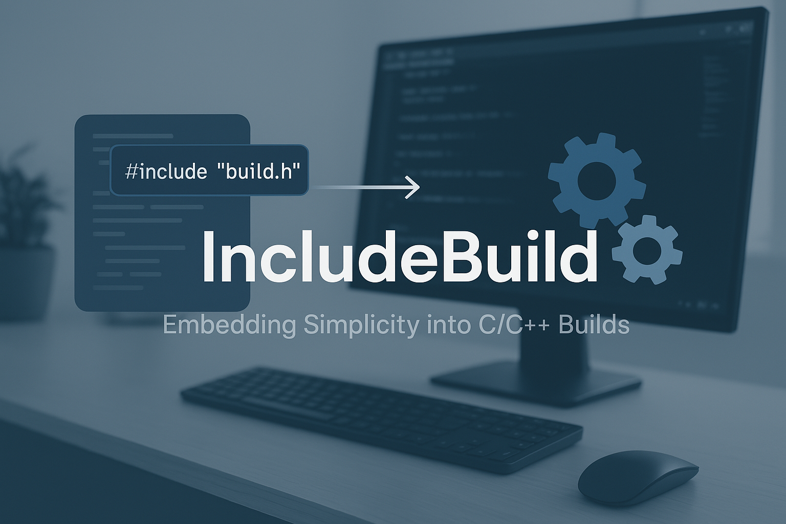

# IncludeBuild

[](https://opensource.org/licenses/MIT)


A minimalist, header-only build system for C/C++ projects that's included directly in your code.

<p align="center">
  
</p>

## Overview

IncludeBuild transforms how you build C/C++ projects by embedding the build system directly in your source code. No more complex build configurations or dependency on external tools - just include a single header and you're ready to go.

```c
#include "build.h"  // That's it! Your build system is now embedded

int main() {
    // Your code here
    return 0;
}
```

## Key Features

- **Header-only**: Single file inclusion with no dependencies
- **Minimal**: Small API that's easy to learn and use
- **Portable**: Works across platforms with no additional requirements
- **Flexible**: Handles everything from simple projects to complex builds
- **Fast**: Efficient compilation with parallel build support
- **Transparent**: Clearly see what's happening during builds

## Quick Start

1. Copy `build.h` to your project
2. Include it in your build script: `#include "build.h"`
3. Create a build script using the IncludeBuild API
4. Run your build script to compile your project

Example build script:

```c
#include "build.h"

int main() {
    // Initialize the build system
    ib_workspace_t ws = ib_create_workspace();
    
    // Add source files
    ib_add_source_file(ws, "main.c");
    ib_add_source_file(ws, "helper.c");
    
    // Set output executable name
    ib_set_output(ws, "my_program");
    
    // Run the build
    ib_build(ws);
    
    // Clean up
    ib_destroy_workspace(ws);
    return 0;
}
```

## Documentation

For detailed documentation, see the following:

- [User Guide](docs/guide.md)
- [API Reference](docs/api.md)
- [Examples](examples/)
- [FAQ](docs/faq.md)

## Installation

### Option 1: Direct inclusion

Simply copy the `build.h` file from the `src` directory to your project or a location in your include path.

### Option 2: System-wide installation

```bash
git clone https://github.com/yourusername/includebuild.git
cd includebuild
make install
```

This will install IncludeBuild system-wide, allowing you to include it with `#include "build.h"`.

To uninstall:

```bash
make uninstall
```

## Examples

The `examples/` directory contains several example projects:

- **Basic**: Simple single-file project
- **Multi-file**: Project with multiple source files
- **Library**: Building and linking against a static library
- **Custom Limits**: Configuring memory limits for larger projects
- **Logging**: Using the logging API for detailed build information
- **Raylib-Pong**: A small game using the raylib library

Each example demonstrates different features of IncludeBuild.

## Philosophy

IncludeBuild embraces the philosophy that a build system should be:

1. Part of the code, not separate from it
2. Simple to understand and modify
3. Transparent in its operation
4. Minimal in its dependencies
5. Flexible enough to handle diverse projects

## Contributing

Contributions are welcome! Please see [CONTRIBUTING.md](CONTRIBUTING.md) for guidelines.

## License

IncludeBuild is released under the MIT License. See [LICENSE](LICENSE) for details.

## Feedback

Have suggestions or found issues? Please [open an issue](https://github.com/korzewarrior/includebuild/issues) on our GitHub repository.

## Why IncludeBuild?

### Comparison with Other Build Systems

| Feature | IncludeBuild | Make | CMake |
|---------|------------|------|-------|
| Self-contained | ✓ Single header | × Requires Make | × Requires CMake |
| Learning curve | ✓ Just C | × Custom syntax | × Complex syntax |
| Power | ⚠️ Medium | ✓ High | ✓ Very high |
| Transparency | ✓ High | ⚠️ Medium | × Low |
| Large projects | ⚠️ Medium | ✓ Good | ✓ Excellent |

### Benefits

- **Simplicity**: Everything in C, no separate build language to learn
- **Transparency**: See exactly what's happening in your build process
- **Hackability**: Easy to modify and extend
- **Portability**: Just C code, works anywhere with a C compiler
- **Zero Setup**: No tools to install

## Examples

- [Basic example](examples/basic)
- [Multi-file project](examples/multi-file)
- [Library project](examples/library)
- [Raylib Pong game](examples/raylib-pong)

## Acknowledgments

IncludeBuild was inspired by the philosophy that build systems should be simple and transparent. It draws inspiration from projects like:

- [The Zig build system](https://ziglang.org/documentation/master/#Zig-Build-System)
- [Tup](http://gittup.org/tup/)
- [Meson](https://mesonbuild.com/)

### Advanced Configuration

IncludeBuild provides flexible configuration for limits and logging:

```c
#include "build.h"

int main() {
    // Initialize IncludeBuild
    ib_init();
    
    // Set logging level (ERROR, WARN, INFO, DEBUG)
    ib_set_log_level(IB_LOG_DEBUG);
    
    // Build the project
    ib_build();
    
    return 0;
}
```

You can define your own limits before including build:

```c
// Define custom limits for larger projects
#define IB_MAX_FILES 5000
#define IB_MAX_DEPS 500

#include "build.h"

int main() {
    // ... your build code ...
}
``` 